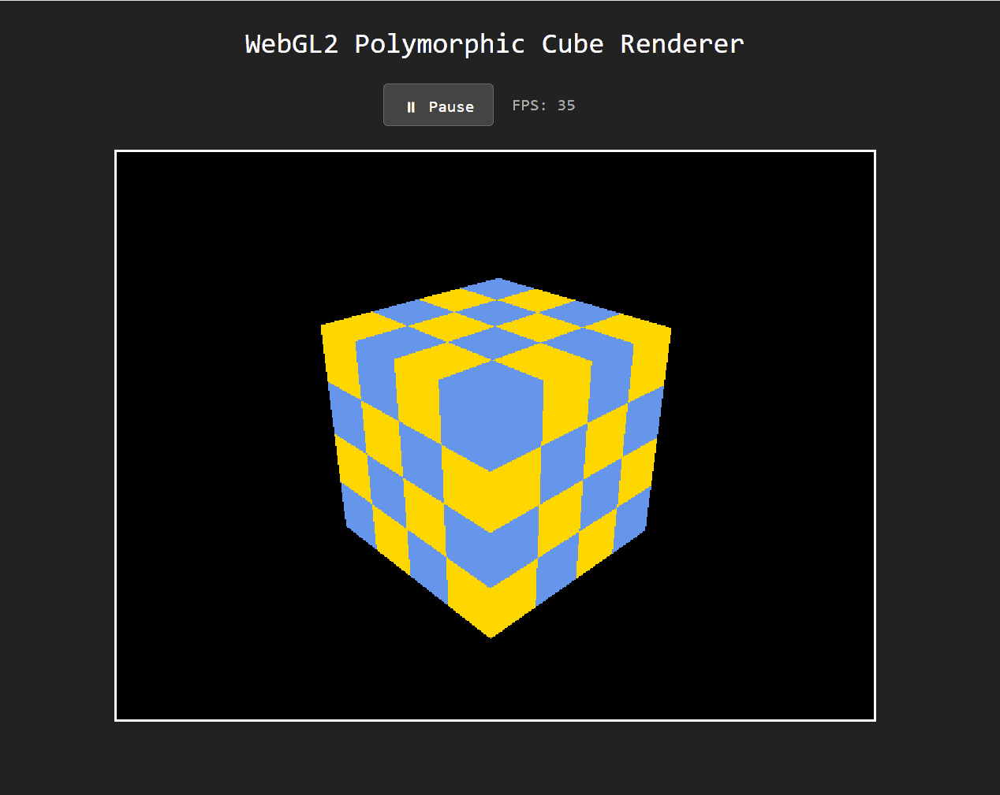
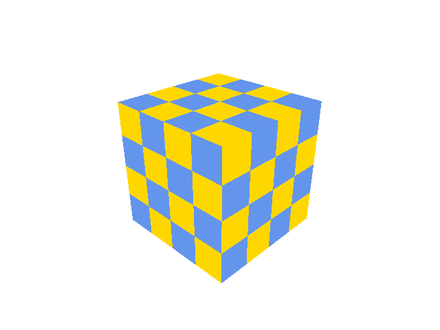

# WebGL2 Development Platform: VISION

GPU in WASM: slow but guaranteed and immovable like Sisyphus's rock.


## 🎯 Quick Start

```javascript
import { webGL2 } from 'webgl2';

// Initialize the Rust-backed WebGL2 context
const gl = await webGL2();

// Use it like a standard WebGL2RenderingContext
const buffer = gl.createBuffer();
gl.bindBuffer(gl.ARRAY_BUFFER, buffer);
```

```bash
# Build the project (Rust + WASM)
npm run build

# Run the extensive test suite
npm test
```

[🧊Demo WebGL/WASHM](https://webgl2.was.hm)



## ✨ Key Features

- **Rust-Owned Context**: All WebGL2 state (textures, buffers, framebuffers) lives in Rust for deterministic resource management.
- **GLSL to WASM Compiler**: Compiles GLSL shaders directly to WebAssembly using Naga IR.
- **Integrated Debugging**: Generates DWARF debug information for shaders, enabling step-through debugging in browser DevTools.
- **Software Rasterizer**: A full software-based WebGL2 implementation for headless testing and GPU-independent execution.
- **JS Thin-Forwarder**: Ergonomic JavaScript bindings that forward calls to the WASM core with minimal overhead.

## 🚀 Project Overview and Goals

The project aims to create a **Composite WebGL2 Development Platform** built with **Rust and WASM**. The primary objective is to significantly improve the WebGL2 developer experience by introducing standard software engineering practices—specifically, **robust debugging and streamlined resource management**—into the WebGL/GLSL workflow, which is currently hindered by hairy API, lack of debugging, incomprehensible errors and opaque GPU execution.

| Key Goals | Target Block | Value Proposition |
| :--- | :--- | :--- |
| **GPU Debugging** | Block 1 (Emulator) | Enable **step-through debugging**, breakpoints, and variable inspection for GLSL code. |
| **Unit Testing** | Block 1 (Emulator) | Provide a stable, deterministic environment for **automated testing** of graphics logic. |
| **Tech Stack** | Both | Utilize **Rust for safety and WASM for high-performance cross-platform execution** in the browser. |

-----

## 🏗️ Architecture

The platform follows a "Rust-first" architecture where the GPU state and shader execution are managed by a high-performance Rust core compiled to WASM.

1. **Frontend**: A thin JS wrapper (`WasmWebGL2RenderingContext`) that mirrors the WebGL2 API.
2. **Compiler**: Uses **Naga** to parse GLSL and a custom **WASM Backend** to emit executable WASM modules with DWARF debug info.
3. **Emulator**: A software rasterizer (`wasm_gl_emu`) that executes shader logic and manages the framebuffer.
4. **Context**: A centralized registry (`webgl2_context.rs`) that tracks all GL resources and handles lifecycle.

## 🔧 Development Status

**Current Phase: Phase 1 - Core Emulator & Compiler** ✅

- [x] Rust-owned WebGL2 Context & Resource Registry
- [ ] Naga-to-WASM backend with DWARF support - partially done
- [ ] Software Rasterizer for shader emulation - partially done
- [x] JS/TS ergonomic bindings - substantially working
- [ ] Extensive WebGL2 API test coverage - partially done (>100 tests)
- [ ] Browser DevTools integration validation (in progress)

## Quick demo

```bash
node test/visual_demo.js
```



Uses a simple texture shader to render a cube into an `output.png` file.


## 📚 Documentation

- [`docs/1-plan.md`](docs/1-plan.md) - Original project proposal and plan
- [`docs/1.1-ir-wasm.md`](docs/1.1-ir-wasm.md) - Naga IR → WASM architecture
- [`docs/1.1.1-webgl2-prototype.md`](docs/1.1.1-webgl2-prototype.md) - Rust-owned Context design
- [`docs/1.1.2-texture.md`](docs/1.1.2-texture.md) - Texture implementation details
- [`docs/1.1.3-rust-wasm-test-coverage.md`](docs/1.1.3-rust-wasm-test-coverage.md) - Testing strategy and coverage

## 🧪 Testing

```bash
# Run Rust tests
cargo test

# Run JS tests
npm test

# Test with a simple shader (prototype, experimental)
cargo run --bin webgl2 -- compile tests/fixtures/simple.vert --debug -o output.wasm
cargo run --bin webgl2 -- run output.wasm
```

## 📄 License

MIT
